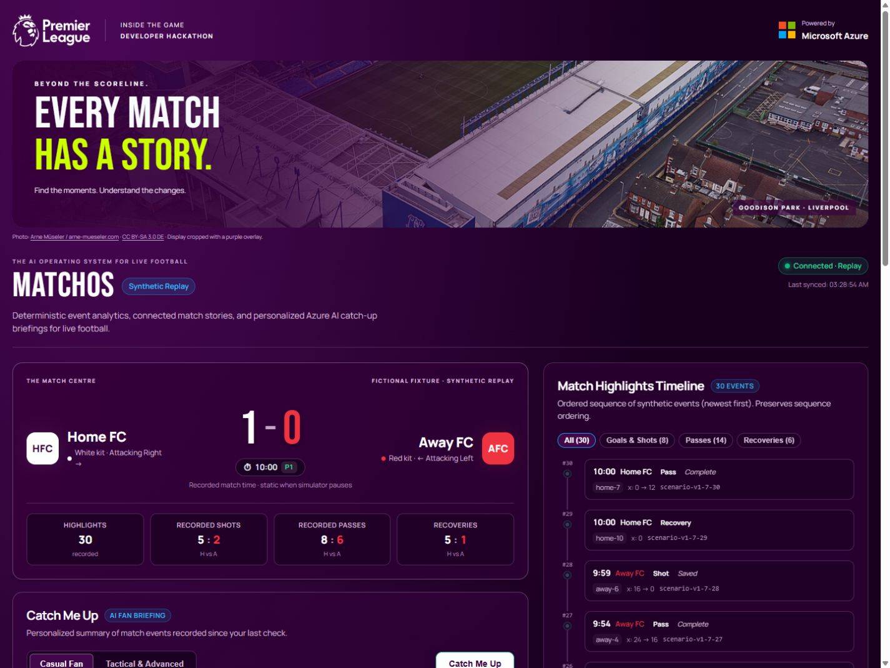

# MatchOS
### The AI Operating System for Live Football

MatchOS turns a stream of football events into a match story fans can understand and verify. It connects recorded actions to emerging patterns, explains what changed, and helps returning viewers catch up without watching every missed minute.

Built for **Inside the Game: Developer Hackathon**, with synthetic football data, a React match experience, and an evidence-first path to Microsoft-powered AI.

[Explore the code](https://github.com/plopez-4/matchos) · [Latest dashboard](https://github.com/plopez-4/matchos/tree/feature/match-page-polish) · [Patch notes](CHANGELOG.md) · [Visual credits](docs/visual-assets.md)



## The broadcast experience

The current dashboard combines a purple-and-white Premier League-inspired theme, league artwork, a credited Goodison Park photograph and a Microsoft Azure technology label. Manrope and Bebas Neue fonts load locally.

Home FC wears white; Away FC wears red. Scores, recorded statistics, shot bars and timeline labels share those kit colors. A new score increase covers the scoreboard with **GOAL** in the scorer's color for six seconds, then returns to the score. First load and repeated unchanged polls do not replay old goals. Reduced-motion mode keeps the announcement without the wipe/zoom.

Catch Me Up displays **What happened** and **What changed**, with readable supporting events, actual response audience and actual AI mode. Evidence links reveal older or filtered-out timeline entries. Independent connection and Catch Me Up errors preserve a usable last result.

## What we're building

A fan joins a match late. The score tells them who is winning, but they still need context: what happened, how the game changed, and which developments deserve attention.

MatchOS brings those answers together:

| Feature | What it gives the fan |
| --- | --- |
| **Live match view** | A score, event timeline and recorded match statistics that update during replay. |
| **Match intelligence** | Reproducible comparisons that reveal changes in recorded activity. |
| **Match Story Graph** | Connections from events to calculated patterns to explanations, with inspectable evidence. |
| **Catch Me Up** | A summary of events and stories since the viewer's last check. |
| **Personalization** | Casual or advanced explanations built from the same underlying facts. |
| **Evidence-backed AI** | An agent retrieves trusted stories and chooses what to explain; the app checks the selection before displaying it. |

Our first audience is football fans. The longer-term goal is to make the same intelligence useful to broadcasters, studios and streaming experiences.

## See the first match story

The current feature replays a fictional ten-minute highlights scenario: a quiet opening, increased Home shooting activity, a goal, and an Away response.

At the end, MatchOS can explain:

> Home recorded 4 shots in minutes 5–10, compared with 1 in the previous five minutes.

Open **Inspect supporting events** to see the shots behind that statement. Then select **Catch Me Up**:

> Recorded events since your last check: 30. Goals: 1. Home scored at 9:31. Home recorded 4 shots in minutes 5–10, compared with 1 in the previous five minutes.

Request it again without new events and the summary reports zero new events. The viewer cursor advances only after a successful response.

This comparison describes recorded shooting activity. It does not establish possession, tactical pressure or why the goal happened.

## Development status

**This is an actively developed hackathon prototype.** Features are being reviewed in pull requests before integration.

| Location | What's available |
| --- | --- |
| `main` / `develop` | Initial FastAPI and React foundation, synthetic replay, count analytics and basic Catch Me Up. |
| [`feature/evidence-backed-stories`](https://github.com/plopez-4/matchos/tree/feature/evidence-backed-stories) · [PR #1](https://github.com/plopez-4/matchos/pull/1) | Scripted highlights, five-minute shot comparisons, event/metric/story support graph, readable evidence and richer Catch Me Up. Backend and frontend GitHub checks passed. |
| [`feature/grounded-ai-explanations`](https://github.com/plopez-4/matchos/tree/feature/grounded-ai-explanations) · [PR #2](https://github.com/plopez-4/matchos/pull/2) | Optional Azure-backed tool flow for story selection, validation, execution trace and deterministic fallback. Live Azure calls verified for casual and advanced summaries. |
| [`feature/match-page-polish`](https://github.com/plopez-4/matchos/tree/feature/match-page-polish) | Latest broadcast dashboard, kit colors, goal takeovers, fresh replay sessions, evidence navigation and request-state fixes. Stacked on the Azure branch for review. |

The AI adapter is off by default. It uses a Microsoft Foundry Azure OpenAI-compatible model endpoint. The model selects supported story IDs; trusted text is rendered by the app. Free-form AI narration and hosted Foundry Agent Service deployment are future work.

## How MatchOS works

```text
Synthetic football events
          |
          v
Validated ingestion and ordered event storage
          |
          v
Deterministic counts and time-window analytics
          |
          v
Match Story Graph: events -> metrics -> stories
          |
          v
Evidence retrieval and validated AI story selection
          |
          v
Live match cards + personalized Catch Me Up
```

The intelligence layer calculates the facts. Story nodes retain supporting event IDs and versioned rules. The optional AI layer retrieves these candidates and selects their order for the audience. Invalid selections or provider failures fall back to the deterministic summary.

## Try the working demo

**Requirements:** Python 3.11+, Node.js 22.12+, npm and Git. If Windows cannot find `python`, try the Python launcher `py` after installing Python.

Clone the latest working dashboard branch while the stacked changes are under review:

```powershell
git clone --branch feature/match-page-polish https://github.com/plopez-4/matchos.git
cd matchos
```

### 1. Backend terminal

From the repository root:

```powershell
py -3 -m venv .venv
.\.venv\Scripts\python.exe -m pip install -e "./backend[dev]"
.\.venv\Scripts\python.exe -m uvicorn app.main:app --app-dir backend --reload
```

Open the [API explorer](http://localhost:8000/docs). Keep this terminal running.

### 2. Frontend terminal

Open a second terminal in the repository root:

```powershell
cd frontend
npm.cmd ci
npm.cmd run dev
```

Open the address Vite prints, normally [MatchOS](http://127.0.0.1:5173). If that port is occupied it may choose another. Keep this terminal running too.

### 3. Simulator terminal

Open a third terminal in the repository root:

```powershell
.\.venv\Scripts\python.exe simulator/run.py --seed 7 --count 30 --interval 3
```

Keep the page open at 0–0 before starting. Events arrive every three seconds; the replay lasts about 90 seconds and Home scores about a minute into it. Watch the GOAL takeover, **1–0 score**, and shooting-activity story appear. Inspect evidence and try Catch Me Up twice. Use `--interval 0.5` for a faster run.

On macOS/Linux, replace `.\.venv\Scripts\python.exe` with `.venv/bin/python`, use `python3 -m venv .venv`, and use `npm` instead of `npm.cmd`.

**Replay notes:** the scenario contains 30 recorded highlights, five Home shots and two Away shots. It is a sparse fixture, not a complete match feed. Replaying the same seed/count does not duplicate events. Restarting the backend clears all matches.

For a fresh replay without interrupting the Azure connection, open `http://127.0.0.1:5173/?match=replay-02` before running:

```powershell
.\.venv\Scripts\python.exe simulator/run.py --seed 7 --count 30 --interval 3 --match-id replay-02
```

Use a new ID each time and the actual frontend port. Match IDs in the UI accept letters, numbers, underscores and hyphens, up to 80 characters. Without a valid query, the UI displays `demo-match`. Reload resets the viewer cursor, not backend events.

For Azure story selection, follow the [Azure configuration guide](docs/azure-ai.md). The working deployment is `matchos-explainer`, using Azure-hosted `gpt-4.1-mini`. Credentials stay on the backend; never commit keys or place them in React/VITE variables. An unconfigured clone remains usable with deterministic summaries.

## Technology and repository

| Area | Technology / location |
| --- | --- |
| Backend | Python, FastAPI, Pydantic · `backend/app/` |
| Frontend | React, Vite · `frontend/src/` |
| Synthetic data | Seeded Python scenario · `simulator/` |
| Shared contract | Versioned JSON Schema · `schemas/` |
| Verification | pytest, mocked provider tests, frontend builds, GitHub Actions |
| Microsoft integration | Working Azure OpenAI-compatible Foundry model endpoint; optional verified story selection |
| Documentation | Product, architecture, API, milestone and submission plans · `docs/` |

### Run checks

From the repository root, with backend dependencies installed:

```powershell
.\.venv\Scripts\python.exe -m pytest backend/tests
cd frontend
npm test
npm run build
```

Latest local validation: **18 backend tests, 12 frontend tests, and a successful production build**. Frontend regression tests use production state/scorer/timeline logic. Browser checks verified live Azure Casual/Advanced summaries, hidden evidence navigation, mobile layout, asset loading, kit colors and a red-team goal takeover in an isolated synthetic test. Mock tests do not require Azure credentials. Check the current GitHub Actions run before claiming hosted CI passed.

## What we're working on next

- Integrate the stacked pull requests and verify clean-clone setup.
- Expand synthetic match realism and support more evidence-backed patterns.
- Persist events, story history and viewer preferences.
- Rehearse the polished fan experience and prepare a functioning demo under two minutes.
- Confirm category-specific hero technologies and remaining submission requirements.

Current storage is in memory and resets on restart. The backend supports one process, and the graph is computed from current events rather than persisted history. Authentication, bounded queries and deployment controls remain future work.

## Team workflow

Use `develop` for integration and `main` for tested releases. Create feature branches, keep changes focused, and submit pull requests with demo steps and verification. Backend/integration, frontend, and intelligence/AI are the main ownership areas.

See [CONTRIBUTING](CONTRIBUTING.md), the [milestone plan](docs/milestone-1.md), and the [initial task drafts](docs/github-issues.md).

## License

[MIT](LICENSE) for application code. Third-party artwork, photography and fonts have separate terms in [visual-assets.md](docs/visual-assets.md); photograph attribution is visible in the UI. League/Microsoft marks remain their owners' property; no endorsement is claimed. All demo teams, players and match events are fictional. No real Premier League match data is included.
